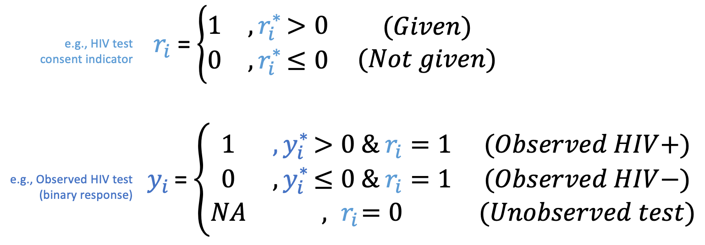

```{r setup, include=FALSE}
knitr::opts_chunk$set(warning = FALSE, message = FALSE) 
```

# {.tabset}

## Applied example
This document will help you to understand the Heckman model concepts in a more graphical way. Here we used the HIV dataset simulated by Marra (2009). The original dataset mimics a HIV survey conducted in Zambia in 9 regions, where 17 different covariates were collected. Here, to make more easy the explanation, we focus in the region # 5, and we only use 5 predictors: age, marital status (marital), use of condom in the last relationship (condom),HIV risk of the patient (highhiv) and interviewer identity (InterviewerID).

Here we assumed that the first 4 predictors variables are included in both the outcome and selection model. In addition, on the selection equation we included interviewerID as exclusion restriction variable. Therefore, the Heckman model can be described then by the following equations:
```{r heck1, echo=FALSE, out.width = '70%'}
knitr::include_graphics("Heckman_model.png")
```

Here $y_i^*$ and $r_i^*$ are latent variables or unobservable in the given dataset. But they are related to the observed variables $r_i$ indicator of hivconsent (hivconsent) and $y_i$ the observed hiv test result (hivtest).

```{r heck2, echo=FALSE, out.width = '70%'}

```
Initially we load the package and the original dataset, and we filter out the region #5 and the included variables.
```{r data, warning=FALSE}
library(GJRM)
library(data.table)
library(mice)
library(dplyr)
library(lme4)
data("hiv")
samp.hiv <- setDT(hiv)[region==5,
                       c("hiv","hivconsent","age","marital","condom","highhiv","interviewerID")]
summary(samp.hiv)

```

Summarizing the selected database, we note that all predictor variables are complete, and the only missing value is HIV tests (hiv).  From the observable HIV tests, we can estimate that the prevalence in the region is approximately 17.17% (hiv mean).

Regarding the exclusion restriction variable (InterviewID), we note that in the selected region, 17 enumerators conducted the survey with a different number of respondents [1,198].

```{r data2, warning=FALSE}
samp.hiv$interviewerID <-  as.factor(as.character(samp.hiv$interviewerID))
table(samp.hiv$interviewerID)
```

InterviewerID can be included in the selection equation in different ways (Chan & Cook,2020), here we choose to use the random effects of each interviewer. Therefore, we estimate the random intercept effect of each interviewer using the following generalized mixed model.

```{r IDinterviewer}
ID_mixed <- glmer(hivconsent ~(1 | interviewerID), data = samp.hiv, family = binomial)
reffect  <- ranef(ID_mixed)$interviewerID
reffect$interviewerID <- levels(samp.hiv$interviewerID)
colnames(reffect)     <- c("IDreffect","interviewerID")
samp.hiv  <-  merge(samp.hiv, reffect, by="interviewerID", all.x=TRUE)
```

There are different functions available in R that can be used to impute missing variables that follow a MNAR mechanism according to the Heckman model. For example, within the R package GJRM (Marra & Radice,2022), the mice imputation method "copulaSS" can be used to impute missing data based on a Heckman model and copula functions. Similarly, the function mice.impute.heckprob() from the R package MICEMNAR described in Galimard et al (2016,2018) can also be used. Here we use an imputation method that we have coded ourselves for hierarchical datasets, but which can also be used for non-clustered datasets.

```{r Impute}
source("mice.impute.heckman.ipd2.R")
```

In the model we chose to include a smoothed term of the age variable. Because our imputation method is not possible to include the smoothed term, we precompute the smoothed age terms and store them in the dataset as individual variables. Before performing imputation, we removed redundant terms (due to multicollinearity problems), and ensured that the response variable was included as a factor variable. 
```{r smooth}
mod <- gam(hivconsent~-1+s(age),data=samp.hiv[,c("age","hivconsent")])
sage<-as.data.table(model.matrix(mod))
colnames(sage)<-paste0("sage",(1:ncol(sage)))
samp.hiv<-cbind(samp.hiv,sage)
samp.hiv$age<-NULL
samp.hiv$interviewerID<-NULL
samp.hiv$hivconsent<-NULL
samp.hiv$hiv<-as.factor(samp.hiv$hiv)
```

Next we specify the prediction (pred0) and methods(meth0) objects which are required as parameters in the mice function.
```{r Impute1}
  ini <- mice(samp.hiv, maxit = 0)
  meth0<-ini$method
  pred0 <- ini$pred
```

Initially, we impute the missing variable hiv using the "pmm" method that follows a MAR mechanism assumption.
```{r Impute2}
  meth0
  pred0["hiv",] 
```

Here, we run the mice function by passing meth0 and pred0 objects.
```{r Impute3,echo = T, results = 'hide'}
imp_mar <- mice( data=samp.hiv, # dataset with missing values
                       m = 10,   # number of imputations
                       meth = meth0, #imputation method vector
                       pred = pred0, #imputation predictors matrix
                       maxit=1)
```

Next, we impute the hiv variable assuming it follows an MNAR mechanism. We must specify in the method object (meth0) that the hiv variable will be imputed with the imputation based on the Heckman model with the name "heckman.ipd2". In addition, in the prediction object (pred0), we must set all predictors included in the outcome and selection equation as "1", and the exclusion constraint variable as "-3".

```{r Impute4}
meth0[c("hiv")]<-"heckman.ipd2"
meth0
pred0["hiv","IDreffect"] <- -3
pred0["hiv",] 
```

Next, we pass by the meth0 and pred0 objects in the mice function as we did before.
```{r Impute5,echo = T, results = 'hide'}
imp_heck <- mice( data=samp.hiv, # dataset with missing values
                       m = 10,   # number of imputations
                       meth = meth0, #imputation method vector
                       pred = pred0, #imputation predictors matrix
                       maxit=1)
```

Finally, we cluster the results using Rubin's rule for each of the imputed datasets, we use the f.abs.perstudy function which is available in the source code accompanying this repository.

```{r rubins,echo = T}
  mar_res<-f.abs.perstudy(data=complete( imp_mar, "long"),outcome_name<-"hiv")
  heck_res<-f.abs.perstudy(data=complete( imp_heck, "long"),outcome_name<-"hiv")
  res<-rbind(mar_res,heck_res)
  res$method<-c("MAR","Heckman")
  setDT(res)[,c("method","incidence","ci.lb","ci.ub")]
```

From the imputation results, we observe that HIV prevalence from MAR imputation (17.5%) is close to the prevalence obtained from observable data alone (17.7%). Imputation based on the Heckman imputation model (19.4%) shows that HIV prevalence could be higher than observed prevalence, suggesting that patients with HIV+ testing are more reluctant to provide HIV consent.

## Variation of $\rho$

Here we observe that by varying $\rho$ the correlation parameter between the outcome equation and the selection equation, not only does the relationship between the errors of both equations vary (figure on the left), but also the relationship between the latent responses varies (smooth line in the figure on the right).

 For example, when $\rho=-1$ the value of an unobservable variable, such as distrust in the healthcare system, makes the error terms inversely proportional. Therefore, an increase in the unobservable variable results in a decrease in the propensity to participate ($r_i$) and an increase in the probability of a positive HIV result ($y_i$). This can also be glimpsed in the prevalence table, where the actual prevalence of HIV+ cases (HIV+ in all patients = 22%) is underestimated by estimating the prevalence only in observed patients (HIV only in observed patients = 9%).

When $\rho=0$ , the data set follows a MAR mechanism in which error terms occur independently and randomly and thus do not affect the trend of latent responses. In this way the prevalence of the total population (22%) can be approximated by the prevalence based only on observable patients (23%).

On the other hand, when $\rho= 1$, we are in a situation where there is an unobservable variable, such as testing being a requirement for access to an antiretroviral therapy (ART) program, which makes patients more likely to have HIV more available to give HIV consent. Therefore, in this situation the population-wide prevalence (HIV+ in all patients = 22%) is overestimated based only on observable patients (HIV only in observed patients = 28%).


```{r echo=FALSE}
source("mice.impute.heckman.ipd2.R")
imp_shiny1()
```

## Incentive as ERV

In this tab we visualize how the use of incentives such as ERV affects the imputation results. We have added a slider where the proportion of patients with no incentive (leftmost part of the slider), those who received a small incentive (middle part of the slider) and those who received a high incentive (rightmost part of the slider) can be specified.

The allocation of incentives in this example was randomized. Simply put, an incentive causes the observability threshold, which establishes whether a measure is observed or not, to shift to the left (see figure below). 

That is, when an individual receives no incentive, his threshold remains at zero, so if his propensity score is greater than zero, his outcome is observed.In contrast, when an individual receives a small incentive, his threshold is reduced by 1 unit, so that if for example his propensity value was -0.5 with no incentive, with the small incentive the individual changes his mind and agrees to the HIV test since -0.5 > -1.

On the other hand, in the case of a staggered incentive, i.e. when the population receives different incentive values. For example in this example we simulate that subjects randomly receive no incentive, a small incentive and a high incentive. Particularly, in this case if a subject receives a high incentive, its observability threshold is reduced by 2 units.

The table on the left shows the number of individuals and their HIV status when tests were observed and unobserved as a function of incentive allocation. The last row of this table shows the actual HIV status of the patients in the survey.

We applied different methods and VRE to the simulated data, and the estimated prevalences in each of the imputed databases are displayed in the table on the left. In general, it is observed that when rho=0, the MAR imputation method (pmm) provides the least bias. As rho moves away from zero, it is observed that Heckman imputation methods provide better estimates of HIV prevalence. In most cases it is observed that not using VRE in the Heckman model can lead to more biased estimates. In general, better prevalence estimates were obtained when the best ones are those in which scaled or combined incentives (interviewer ID and incentive) were used as VREs. However, the effectiveness of these VREs depends on the proportion and which individuals were randomly assigned to each of the incentive groups.


```{r echo=FALSE}
source("mice.impute.heckman.ipd2.R")
imp_shiny2()
```
